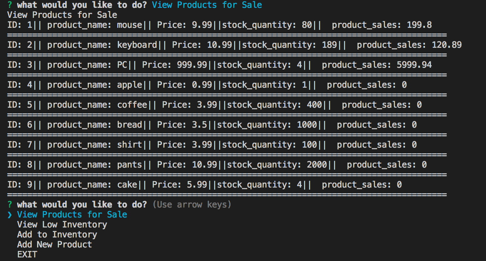
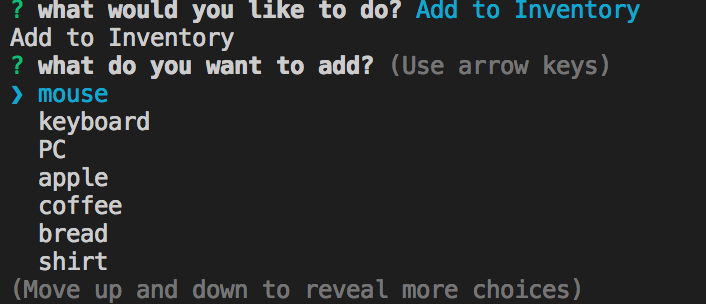

# Bamazon

## Overview

In this activity, you'll be creating an Amazon-like storefront with the MySQL skills you learned this week. The app will take in orders from customers and deplete stock from the store's inventory. As a bonus task, you can program your app to track product sales across your store's departments and then provide a summary of the highest-grossing departments in the store.

Make sure you save and require the MySQL and Inquirer npm packages in your homework files--your app will need them for data input and storage.

### Challenge #1: Customer View (Minimum Requirement)
* Bamazon is a command line node application that resembles the inventory tracking of an online retailer.

* Run the command **node bamazonCustomer.js**

  * You will be prompted with a list of all available items for purchase and asked to enter the item id for your desired item and how many you would like.

  * The app checks the MySQL database. If there is not enough of the item in inventory to fill the order, the user is alerted of insufficient quantity. If there is enough inventory, the database is updated with the depleted quantity and the user is told the total cost of their purchase.

### Challenge #2: Manager View (Next Level)

* Run the command **node bamazonManager.js**
  

  * If a manager selects `View Products for Sale`, the app should list every available item: the item IDs, names, prices, and quantities.
 

   * If a manager selects `View Low Inventory`, then it should list all items with an inventory count lower than five.
 

   * If a manager selects `Add to Inventory`, your app should display a prompt that will let the manager "add more" of any item currently in the store.
 
 

  * If a manager selects `Add New Product`, it should allow the manager to add a completely new product to the store.

 

### Challenge #3: Supervisor View (Final Level)

* i have problem to make SQL Query...so i could not have right product_sales by department...
  i will ask TA to help me out.

- - -